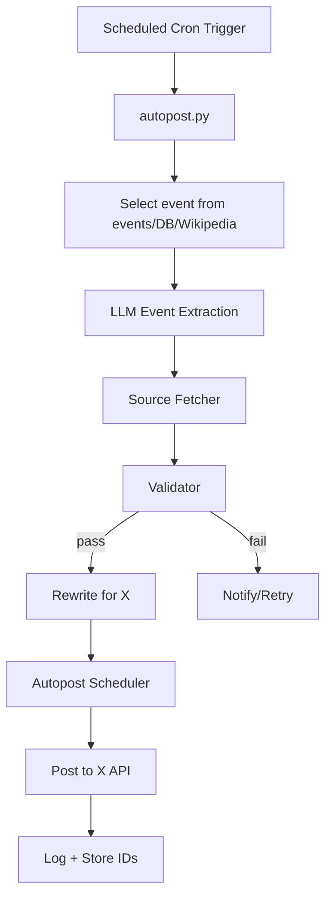

# HistoryMosaic Automation Blueprint

This document captures a production-grade, serverless architecture for automating HistoryMosaic posts with strong fact-checking and posting reliability. It maps directly onto this repository and is suitable for a portfolio-quality implementation.

## 1) Recommended Architecture (Industry Standard)
- **Pattern:** Serverless, event-driven pipeline with automatic retries, low operational overhead, and cron-based scheduling.
- **Suggested providers:** Cloudflare Workers Cron or Vercel Cron (or AWS Lambda + EventBridge) for scheduled execution.
- **LLM access:** OpenAI/Anthropic APIs with structured prompts for deterministic, modular outputs.
- **Storage:** Supabase/Postgres for events/logs or S3-compatible bucket for artifacts; optional Durable Object/Redis queue for ordered thread posting.
- **Posting:** X API v2 (OAuth 2.0) with bearer tokens; synchronous thread replies to preserve order.
- **Observability:** Logflare or Supabase logging for request/response traces and posting receipts.

### Visual Overview (Mermaid)


## 2) Repository & Folder Structure
```
historymosaic/
├── prompts/
│   ├── event-extraction.md
│   ├── source-fetcher.md
│   ├── validator.md
│   ├── rewrite-for-x.md
│   ├── autopost-scheduler.md
│   └── versions/
│       ├── v1/
│       ├── v2/
│       ├── stable/
│       └── experimental/
├── events/
│   ├── 1963-08-28-march-on-washington.json
│   └── ...future events (plus optional index.json)
├── src/
│   ├── fetch_source.py
│   ├── extract_event.py
│   ├── validate_event.py
│   ├── rewrite_x.py
│   ├── schedule.py
│   ├── autopost.py
│   ├── post_to_x.py
│   └── utils/
│       ├── openai_client.py
│       ├── x_client.py
│       └── log.py
├── tests/
│   └── test_pipeline.py
├── .env
├── README.md
└── vercel.json / wrangler.toml (if serverless)
```

### Prompt Versioning
- Keep default prompts at `prompts/`.
- Track iterations under `prompts/versions/{v1,v2,...}` with a `stable/` channel for production and `experimental/` for testing.
- Document breaking changes or parameter shifts in a small changelog per version.

## 3) Data Flow (Daily Engine)
1. **Cron trigger** → `src/autopost.py` kicks off daily.
2. **Select event** → pull from `/events`, a DB query (`event_date LIKE '%-MM-DD'`), or Wikipedia "On This Day".
3. **Event Extraction prompt** → rebuild structured event JSON even for cached events to catch source edits.
4. **Source Fetcher prompt** → retrieve citation-grade excerpts to support validation and attribution.
5. **Validator prompt** → pass/fail gate; on failure, retry extraction or flag/skip and notify (Slack/Discord optional).
6. **Rewrite-for-X prompt** → produce tweet + optional thread from validated facts.
7. **Autopost Scheduler prompt** → choose slot (time of day, tweet vs. thread, topic spacing, tone alignment).
8. **Post to X** → single tweet via `POST /2/tweets`; threads via sequential replies; optional media upload; log tweet IDs, payloads, and outcomes.

## 4) Prompt Orchestration Strategy
- **LLM cascade:** Extractor → Fetcher → Validator → Rewriter → Scheduler.
- **Strict schemas:** Each stage enforces typed JSON to minimize drift and make failures actionable.
- **Retry & gating:** Validator must greenlight outputs before rewriting/posting; retries limited with alerts.
- **Safety:** Avoid unsourced claims; keep hallucination risks visible in intermediate JSON.

## 5) Posting Engine Notes
- **Authentication:** OAuth 2.0 with refresh handling inside `utils/x_client.py`.
- **Ordering:** Thread posts must wait for the prior tweet ID; queueing (Durable Objects/Redis) prevents collisions.
- **Resilience:** Automatic retries for transient HTTP errors; structured logging for every API call.
- **Media:** Attach archival images when available; fall back to AI prompts only when necessary.
- **Rate limits:** Detect X API rate-limit headers, back off with jittered retries, and persist queue state so posts resume in order.

## 6) Scaling & Roadmap Ideas
- Multiple daily posts and per-region/per-theme filters.
- Carousel or thumbnail generation; AI reenactment imagery.
- Public site + newsletter powered from the same `events` data.
- Engagement analytics dashboard and historical posting graph.
- Content deduplication and topic spacing to avoid repetition.

## 7) Implementation Notes for This Repo
- The `history/prompts/` directory already contains the prompt set; wire them into `src` modules above.
- Add environment defaults in `.env.example` for API keys and cron config when ready.
- Keep utilities free of heavy dependencies; lean on provider SDKs and the Python standard library.
- Prefer small, testable functions; `tests/test_pipeline.py` should exercise the full cascade with fixtures.
